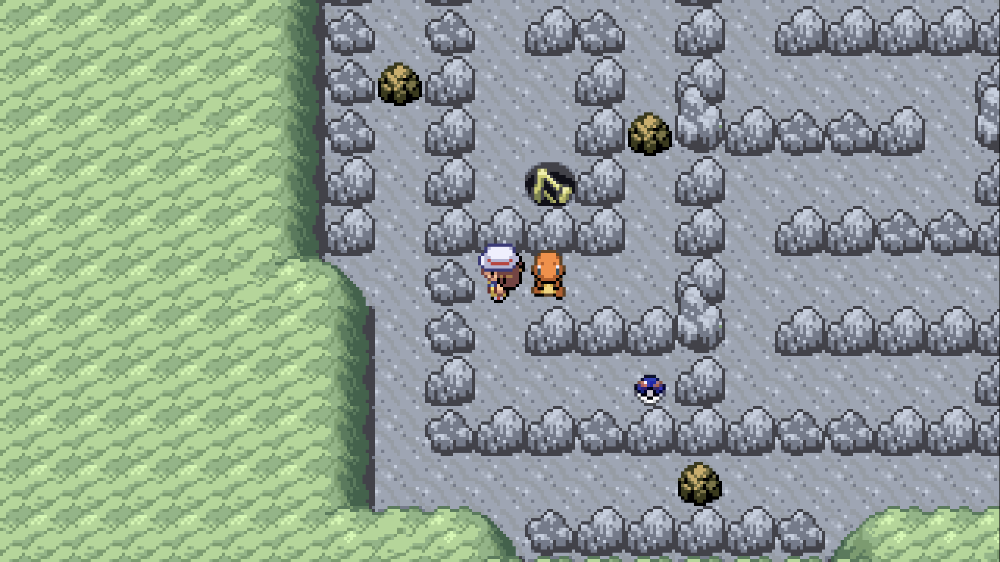
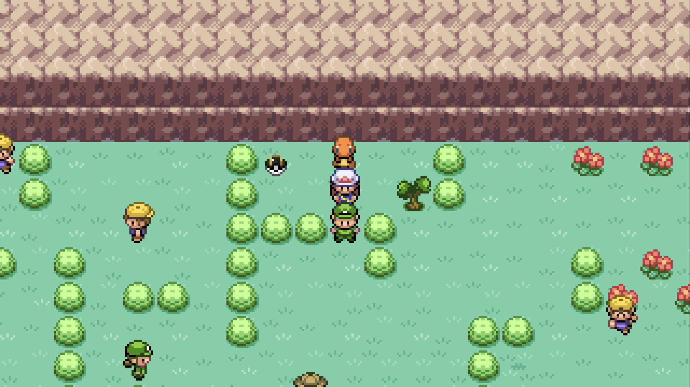
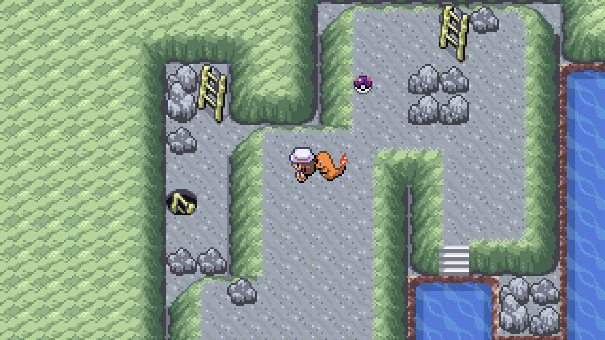

# Gen 3 Ball Rarity

A G1R Deluxe mod for **Pokémon FireRed / LeafGreen** that changes the appearance of overworld item pickups based on the value and usefulness of the item they contain.

Instead of every overworld item pickup using the standard Poké Ball appearance, pickups are displayed as a **Poké Ball, Great Ball, or Ultra Ball** according to their assigned rarity.
Optional Support for Master Balls if they are in world loot from another mod.

* 3 Files (yippee I finally figured out how sprite sheets work)
* Designed to be compatible with other Gen 3Recomp mods, so it's not hardcoded per drop. Changes based on the item inside

## Screenshots

### Great Ball

### Ultra Ball

### Master Ball

